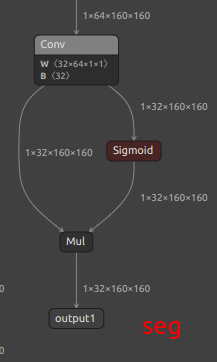
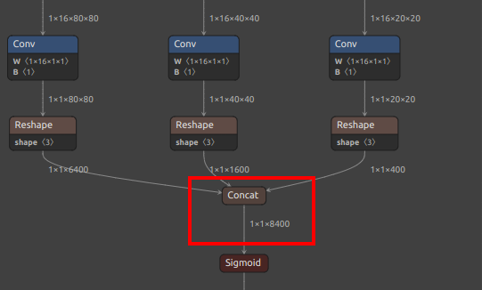

## Introduction

The default official model provides detection for 80 different objects. If this doesn't meet your needs, you can train your own model to detect custom objects, which can be done on your own computer or server by setting up a training environment.

YOLOv8 / YOLO11 not only supports object detection but also supports keypoint detection with YOLOv8-pose / YOLO11-pose. Apart from the official human keypoints, you can also create your own keypoint dataset to train models for detecting specific objects and keypoints.

Since YOLOv8 and YOLO11 mainly modify the internal network while the preprocessing and post-processing remain the same, the training and conversion steps for YOLOv8 and YOLO11 are identical, except for the output node names.

**Note:** This article explains how to train a custom model but assumes some basic knowledge. If you do not have this background, please learn it independently:
* This article will not cover how to set up the training environment; please search for how to install and test a PyTorch environment.
* This article will not cover basic machine learning concepts or Linux-related knowledge.

If you think there are parts of this article that need improvement, please click on `Edit this article` at the top right and submit a PR to contribute to the documentation.

## Process and Article Goal

To ensure our model can be used on MaixPy (MaixCAM), it must go through the following steps:
* Set up the training environment (not covered in this article, please search for how to set up a PyTorch training environment).
* Clone the [YOLO11/YOLOv8](https://github.com/ultralytics/ultralytics) source code locally.
* Prepare the dataset and format it according to the YOLO11 / YOLOv8 project requirements.
* Train the model to obtain an `onnx` model file, which is the final output of this article.
* Convert the `onnx` model into a `MUD` file supported by MaixPy, as described in the [MaixCAM Model Conversion](../ai_model_converter/maixcam.md) article.
* Use MaixPy to load and run the model.

## Where to Find Datasets for Training

Please refer to [Where to find datasets](../pro/datasets.md)


## Reference Articles

Since this process is quite general, this article only provides an overview. For specific details, please refer to the **[YOLO11 / YOLOv8 official code and documentation](https://github.com/ultralytics/ultralytics)** (**recommended**) and search for training tutorials to eventually export an ONNX file.

If you come across good articles, feel free to edit this one and submit a PR.

## Exporting YOLO11 / YOLOv8 ONNX Models

Create an `export_onnx.py` file in the `ultralytics` directory:

```python
from ultralytics import YOLO
import sys

print(sys.path)
net_name = sys.argv[1] # yolov8n.pt yolov8n-pose.pt # https://docs.ultralytics.com/models/yolov8/#supported-tasks-and-modes
input_width = int(sys.argv[2])
input_height = int(sys.argv[3])

# Load a model
model = YOLO(net_name)  # load an official model
# model = YOLO("path/to/best.pt")  # load a custom model

# Predict with the model
results = model("https://ultralytics.com/images/bus.jpg")  # predict on an image
path = model.export(format="onnx", imgsz=[input_height, input_width])  # export the model to ONNX format
print(path)
```

Then run `python export_onnx.py yolov8n.pt 320 224` to export the `onnx` model. Here, the input resolution is redefined; the model was originally trained with `640x640`, but we specify a different resolution to improve runtime speed. The reason for using `320x224` is that it closely matches the MaixCAM screen aspect ratio, making display easier. For MaixCAM2, you can use `640x480` or `320x240` — feel free to set it according to your specific needs.


## Convert to MaixCAM Supported Models and mud Files

MaixPy/MaixCDK currently supports YOLOv8 / YOLO11 detection, YOLOv8-pose / YOLO11-pose keypoint detection, and YOLOv8-seg / YOLO11-seg segmentation models (2024.10.10).

Convert the models according to [MaixCAM Model Conversion](../ai_model_converter/maixcam.md) and [MaixCAM2 Model Conversion](../ai_model_converter/maixcam2.md).

Note the selection of model output nodes (**Note that your model values may not be exactly the same, just find the corresponding nodes according to the pictures below**):

* Detection models:
  * YOLOv8:
    * `/model.22/Concat_1_output_0`
    * `/model.22/Concat_2_output_0`
    * `/model.22/Concat_3_output_0`
  * YOLO11:
    * `/model.23/Concat_output_0`
    * `/model.23/Concat_1_output_0`
    * `/model.23/Concat_2_output_0`
* Keypoint detection:
  * YOLOv8-pose:
    * `/model.22/Concat_1_output_0`
    * `/model.22/Concat_2_output_0`
    * `/model.22/Concat_3_output_0`
    * `/model.22/Concat_output_0`
  * YOLO11-pose:
    * `/model.23/Concat_1_output_0`
    * `/model.23/Concat_2_output_0`
    * `/model.23/Concat_3_output_0`
    * `/model.23/Concat_output_0`
* Image segmentation:
  * YOLOv8-seg:
    * `/model.22/Concat_1_output_0`
    * `/model.22/Concat_2_output_0`
    * `/model.22/Concat_3_output_0`
    * `/model.22/Concat_output_0`
    * `output1`
  * YOLO11-seg:
    * `/model.23/Concat_1_output_0`
    * `/model.23/Concat_2_output_0`
    * `/model.23/Concat_3_output_0`
    * `/model.23/Concat_output_0`
    * `output1`
* OBB detection:
  * YOLOv8-obb:
    * `/model.22/Concat_1_output_0`
    * `/model.22/Concat_2_output_0`
    * `/model.22/Concat_3_output_0`
    * `/model.22/Concat_output_0`
  * YOLO11-obb:
    * `/model.23/Concat_1_output_0`
    * `/model.23/Concat_2_output_0`
    * `/model.23/Concat_3_output_0`
    * `/model.23/Concat_output_0`

YOLOv8/YOLO11 detection output nodes:


YOLOv8/YOLO11 pose extra output nodes:


YOLOv8/YOLO11 seg extra output nodes:



YOLOv8/YOLO11 OBB extra output nodes:




For object detection, the MUD file would be as follows (replace `yolo11` for YOLO11):

MaixCAM/MaixCAM-Pro:
```ini
[basic]
type = cvimodel
model = yolov8n.cvimodel

[extra]
model_type = yolov8
input_type = rgb
mean = 0, 0, 0
scale = 0.00392156862745098, 0.00392156862745098, 0.00392156862745098
labels = person, bicycle, car, motorcycle, airplane, bus, train, truck, boat, traffic light, fire hydrant, stop sign, parking meter, bench, bird, cat, dog, horse, sheep, cow, elephant, bear, zebra, giraffe, backpack, umbrella, handbag, tie, suitcase, frisbee, skis, snowboard, sports ball, kite, baseball bat, baseball glove, skateboard, surfboard, tennis racket, bottle, wine glass, cup, fork, knife, spoon, bowl, banana, apple, sandwich, orange, broccoli, carrot, hot dog, pizza, donut, cake, chair, couch, potted plant, bed, dining table, toilet, tv, laptop, mouse, remote, keyboard, cell phone, microwave, oven, toaster, sink, refrigerator, book, clock, vase, scissors, teddy bear, hair drier, toothbrush
```

MaixCAM2:
```ini
[basic]
type = axmodel
model_npu = yolo11n_640x480_npu.axmodel
model_vnpu = yolo11n_640x480_vnpu.axmodel

[extra]
model_type = yolo11
type=detector
input_type = rgb
labels = person, bicycle, car, motorcycle, airplane, bus, train, truck, boat, traffic light, fire hydrant, stop sign, parking meter, bench, bird, cat, dog, horse, sheep, cow, elephant, bear, zebra, giraffe, backpack, umbrella, handbag, tie, suitcase, frisbee, skis, snowboard, sports ball, kite, baseball bat, baseball glove, skateboard, surfboard, tennis racket, bottle, wine glass, cup, fork, knife, spoon, bowl, banana, apple, sandwich, orange, broccoli, carrot, hot dog, pizza, donut, cake, chair, couch, potted plant, bed, dining table, toilet, tv, laptop, mouse, remote, keyboard, cell phone, microwave, oven, toaster, sink, refrigerator, book, clock, vase, scissors, teddy bear, hair drier, toothbrush

input_cache = true
output_cache = true
input_cache_flush = false
output_cache_inval = true

mean = 0,0,0
scale = 0.00392156862745098, 0.00392156862745098, 0.00392156862745098
```

Replace the `labels` according to your trained objects.

For keypoint detection (yolov8-pose), modify `type=pose`.
For keypoint detection (yolov8-seg), modify `type=seg`.
For keypoint detection (yolov8-obb), modify `type=obb`.


## Upload and Share on MaixHub

Visit the [MaixHub Model Library](https://maixhub.com/model/zoo?platform=maixcam) to upload and share your model. Consider providing multiple resolutions for others to choose from.
