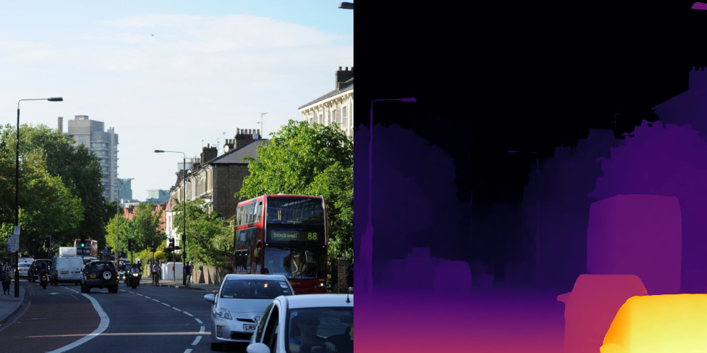

## Introduction

[Depth-Anything-V2](https://github.com/DepthAnything/Depth-Anything-V2) can estimate depth maps from regular images. Compared to Depth-Anything-V1, it has improvements in detail and optimizations in certain materials such as glass. For more information, refer to the [official open-source repository](https://github.com/DepthAnything/Depth-Anything-V2) or the [web homepage](https://depth-anything-v2.github.io/).

<video playsinline controls autoplay loop muted preload src="../../assets/depth_anything_v2.mp4" type="video/mp4" style="min-height:0">
depth_anything_v2.mp4
</video>

## Supported Devices

| Device   | Supported |
| -------- | --------- |
| MaixCAM2 | ✅         |
| MaixCAM  | ❌         |

## Using Depth-Anything on MaixCAM2 MaixPy

MaixPy supports Depth-Anything-V2. Note that the first-generation MaixCAM hardware is not supported.

The default system already includes the model, just run the code directly:

```python
from maix import camera, display, image, nn, app

cmap = image.CMap.TURBO
model = nn.DepthAnything(model="/root/models/depth_anything_v2_vits.mud", dual_buff = True)

cam = camera.Camera(model.input_width(), model.input_height(), model.input_format())
disp = display.Display()

while not app.need_exit():
    img = cam.read()
    res = model.get_depth_image(img, image.Fit.FIT_CONTAIN, cmap)
    if res:
        disp.show(res)
```

Here, the `get_depth_image` function is used to directly obtain a pseudo-color image. The `cmap` can be set to a color map. All supported pseudo-color maps are documented in the `maix.image.CMap` API.

Of course, if you want the model's raw output, you can use the `get_depth` method to obtain the original `float32` data. The returned data can be converted to NumPy format using `maix.tensor.tensor_to_numpy_float32`.

Real-world performance on MaixCAM2:


## Notes

Note that Depth-Anything-V2 performs depth estimation on a single image, and the raw output is a relative value. The value range varies based on the image content. For example, when depth differences are small, the range might be 0.0~2.0; when there is greater variation, it might be 0.0~8.0. The final image is a normalized value between 0~255.

Therefore, for videos or continuous image frames, the absolute depth value may fluctuate. That means when you perform continuous depth estimation using a camera feed, you may observe slight flickering in the output images.

## More Input Resolutions

Due to the high computational demand of the model, the default resolution used is 448x336. If you wish to use other resolutions, you can download available models from the [MaixHub model library](https://maixhub.com/model/zoo?platform=maixcam2). If MaixHub does not have the resolution you need, you can convert the model yourself.

For MaixCAM2, refer to the [model quantization documentation](../ai_model_converter/maixcam2.md) as well as [huggingface.co/AXERA-TECH/Depth-Anything-V2](https://huggingface.co/AXERA-TECH/Depth-Anything-V2/tree/main) and [github.com/AXERA-TECH/DepthAnythingV2.axera](https://github.com/AXERA-TECH/DepthAnythingV2.axera) for model conversion. (Note: The input in `config.json` in that project is BGR, it is recommended to change it to RGB which is the default in MaixPy.)

