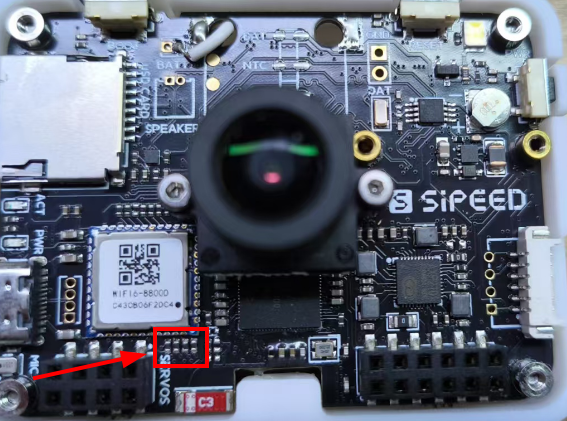

##  蓝牙使用介绍

​	蓝牙是一种常见的短距离无线通信技术，主要用于在两个或多个设备之间建立低功耗、点对点或局部网络的连接。它工作在2.4GHz的频段，最初被设计来替代有线数据线，实现设备之间的小量数据传输。在现代生活中，蓝牙已经成为我们日常使用频率极高的一种技术。例如，当我们在驾车时将手机连接到车载蓝牙系统，可以实现免提通话或播放音乐；使用蓝牙耳机听音乐或打电话时，摆脱了传统耳机线的束缚；在智能家居中，通过蓝牙与门锁、灯光、温湿度传感器等设备联动，构建便捷、高效的居住环境。

## 使用准备

​	对于 MaixCAM和MaixCAM-Pro内置了AIC8800D WIFI/蓝牙双模芯片，但是由于IO资源紧张，默认没有连通主控和蓝牙。如果想要使用蓝牙，则需要将`GPIOA18`,`GPIOA19`,`GPIOA28`,`GPIOA29`与蓝牙的通路间各焊接一颗0欧电阻。

MaixCAM焊接0欧电阻的位置如下图所示：


MaixCAM Pro焊接0欧电阻的位置如下图所示：



> 注意下文主要通过命令行描述蓝牙基础，如果有更多开发需求的同学请先自己探索一下～

## 使能蓝牙

```shell
hciattach -n /dev/ttyS1 any 1500000 &
hciconfig hci0 up
```


## 连接蓝牙鼠标

这里使用bluetoothctl工具配置蓝牙

```shell
bluetoothctl			# 启动bluetoothctl

## 在bluetoothctl的终端下输入下面命令 ##
power on              # 开启蓝牙
agent on              # 开启 agent
default-agent         # 设置为默认代理
scan on               # 扫描设备

# 扫描时找到需要连接的蓝牙MAC地址
pair {设备的MAC地址}        # 配对设备
trust {设备的MAC地址}       # 信任设备
connect {设备的MAC地址}     # 连接设备

# 连接成功后退出
exit
```

验证鼠标数据

```shell
# 执行hcidump命令，可以观察到终端打印所有hci消息
hcidump

# 执行btmon命令，同样可以观察到捕获的HCI事件
btmon
```

## 其它参考

* [使用MaixCAM的蓝牙功能 · 硬件篇](https://maixhub.com/share/58)
* [使用MaixCAM的蓝牙功能 · 软件篇](https://maixhub.com/share/62)


