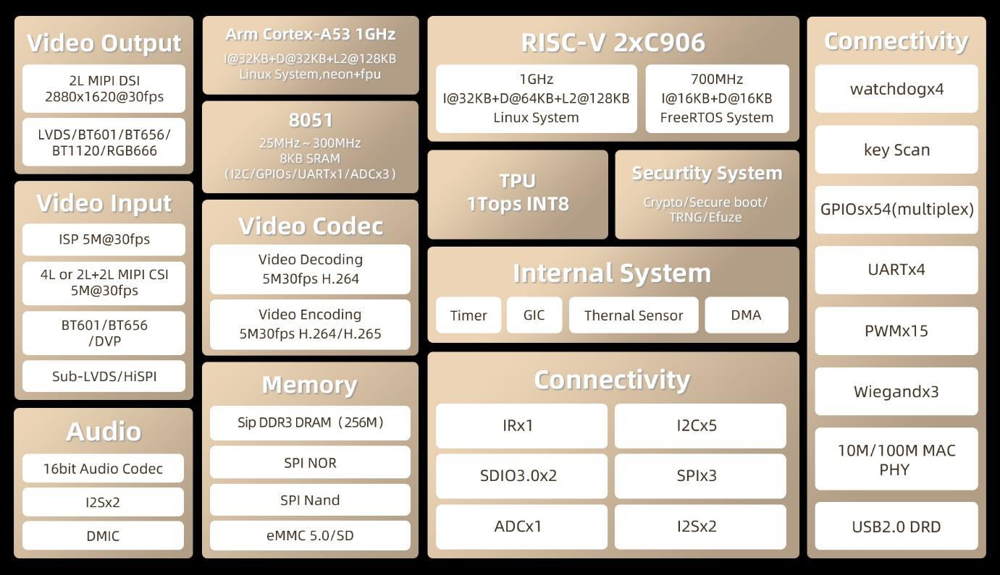

## 什么是引脚/管脚(Pin)

引脚就是芯片/开发板硬件物理上引出来的针脚，在芯片周围，看得见摸得着的，英文我们用`Pin`来表示。

## 什么是片上外设(Peripheral)

即芯片上（内置）的除了 CPU 计算核心以外的挂件，这里的“外”是相对于`CPU 内核`的外，和另外我们后面会说的`片外模块`则是指相对于整个芯片以外的模块区别。
比如下图是 `MaixCAM/MaixCAM-Pro` 芯片内部架构图：



我们可以看到核心有 2个 RISC-V 内核和一个 8051 内核，除此之外，还有很多外设比如`GPIO/UART/H.264编解码器`等等，可以成他们均为片上外设。
主要注意的是，这里的**外设不一定需要引脚引出芯片**，比如`H.264编解码器`也是一个外设，但是不需要引出引脚和外界交互。

另外需要注意，这里`GPIO`是一个外设功能，在芯片内部，和物理上引出芯片的的引脚`Pin`不等同。


## 引脚复用/引脚映射是什么

对于一些需要用引脚与外界交互的外设，比如`GPIO / I2C`， `GPIO` 可以控制引脚输入输出，`I2C`可以通过 `2(SDA/SCL)`两个引脚和其它芯片进行通信。
最简单的做法就是每个芯片引脚对应一个引脚`Pin`，比如上面的芯片架构图中`GPIO` 有`54`个，`I2C`有 `5` 个，一共需要`54 + 2 x 5 = 64`个引脚。
需要引脚的外设功能越多，需要引出芯片的引脚就越多，芯片体积就需要做得越大，而实际应用中往往不需要同时用`54`个`GPIO`功能和`5`个`I2C`，我们希望在外设和引脚之间加一个引脚复用电路，实现一个引脚可以切换到`GPIO`功能，也能切换到`I2C`功能，这样我们只需要引出很少的引脚就能实现我们的应用。
比如使用 `50`个引脚，其中`10`个引脚可以选择`GPIO`功能，也能选择成为`I2C`功能，这就是引脚复用，一般英文叫`pinmux`。

由于硬件设计限制，大多数芯片一个引脚只能映射几个固定的功能，比如对于`MaixCAM-Pro` 引脚映射入下图：


以右边的 `A17`引脚为例，它有三个功能`GPIOA17 / UART0_RX / PWM5`，我们可以根据需要选择这个引脚的功能，比如这个引脚默认功能是`UART0_RX`，我们想用`PWM5`这个功能，则需要设置引脚复用。


MaixPy 中提供了`maix.peripheral.pinmap`(也可以`maix.pinmap`) 这个模块来查询和设置引脚功能复用（引脚功能映射）。


> 另外， 引脚复用的好处可以参考
> * 节省引脚数量：SoC 集成了大量的功能模块，如 CPU、GPU、内存控制器、I/O 接口、通信模块等。如果每个功能都分配独立的引脚，会导致需要的引脚数量非常庞大，增加封装的复杂性和成本。通过引脚复用，一个引脚可以在不同的模式下支持不同的功能，从而显著减少引脚的总数。
> * 降低芯片封装和制造成本：减少引脚数量可以选择更小的封装尺寸，从而降低封装和制造成本。小封装不仅降低了材料成本，还减少了芯片在电路板上的占用空间，有利于设计更紧凑的电子产品。
> * 提高设计灵活性：引脚复用提供了更大的设计灵活性。不同的应用场景可能需要不同的功能组合，通过软件配置可以根据具体需求启用不同的引脚功能。例如，同一个引脚在一个实际应用中可以作为 UART 通信接口，而在另一个实际应用中可以作为 SPI 总线接口。
> * 简化 PCB 布局：减少引脚数量可以简化印刷电路板（PCB）的布局设计。更少的引脚意味着更少的布线层数和过孔，从而简化了 PCB 设计，降低了生产难度和成本。
> * 优化性能：在某些情况下，通过复用引脚可以优化信号路径和性能。例如，通过选择适当的引脚功能组合，可以减少信号传输路径上的干扰和噪声，提高系统的整体性能和可靠性。


## MaixPy 中使用 Pinmap

### 引脚功能图

MaixPy 支持不同的板型引出的引脚不同，这里提供了每个设备的引脚映射简图，更详细的可以看原理图或者芯片手册 Pinmux 章节：

| 设备型号 | 引脚简图 | 说明 | 完整原理图和芯片手册 |
| ------- | ------- | --- | -------------- |
| MaixCAM |  | 板子丝印比如`A19`是引脚名，`GPIOA19/PWM7`是功能名 | 在[硬件资料](https://wiki.sipeed.com/hardware/zh/maixcam/index.html) 中查看 |
| MaixCAM-Pro |  | 第一个名如`A19`是引脚名，对应`GPIOA19/PWM7`是功能名 | 在[硬件资料](https://wiki.sipeed.com/hardware/zh/maixcam/maixcam_pro.html) 中查看 |
| MaixCAM2 |  | 第一个名如`A2`是引脚名，对应`GPIOA2/SPI1_CS0`是功能名  | 在[硬件资料](https://wiki.sipeed.com/hardware/zh/maixcam/maixcam2.html) 中查看  |

> 注意，对于 MaixCAM2，原理图以及芯片资料中可能会有 `GPIO1_A25` 这种写法，为了看起来更简洁，我们将其定义成`B25`，是等效的，又比如`GPIO0_A2`对应 `MaixPy`中的`GPIOA2`，`GPIO3_A2`对应`MaixPy`中的`C2`。
> 即`GPIOn`这里`n`取值`0` 对应了`MaixPy`中定义的`A`，`1`对应了`B`，`GPIO1_A25`的`A25`对应 `MaixPy` 中的`25`即去掉了`A`。


### MaixPy 中映射引脚功能

介绍了那么多，其实 `MaixPy` 使用`maix.pinmap.set_pin_function` 函数即可设置引脚功能。

以设置`MaixCAM/MaixCAM-Pro` `A17`引脚为例：

```python
from maix import pinmap

pinmap.set_pin_function("A17", "GPIOA17")
```

这里`A17`是引脚的名字，`GPIOA17` 是片上外设`GPIO`的功能名，我们就能把这个默认是`UART0_RX`的功能改为`GPIO`功能了，即便我们往芯片的`UART0`发送数据，由于变成了`GPIO`功能，芯片内部也收不到信息了。

设置完引脚功能后，比如这里是设置为`GPIO`，我们就可以按照[GPIO使用](./gpio.md) 文档把这个引脚当作 `GPIO` 输出高低电平，或者读取电平使用了。


### 获得引脚所有功能

我们可以用`maix.pinmap.get_pin_functions` 函数获得一个引脚对应的所有功能：

```python
from maix import pinmap

funcs = pinmap.get_pin_functions("A17")
print(funcs)
```

也可以打印所有引脚和对应的所有功能：

```python
from maix.peripheral import pinmap

print("All pins of MaixCAM:")
print(pinmap.get_pins())

print("All pin's functions:")
for pin in pinmap.get_pins():
    funcs = pinmap.get_pin_functions(pin)
    print(f"{pin:10s}: {', '.join(funcs)}")
```


### 查询引脚当前功能

可以获取到当前引脚设置的功能，注意这个函数对不同板型的支持程度可能不用：
* `MaixCAM / MaixCAM-Pro`: 映射信息储存在一个数组里，不是直接从硬件获取，所以需要先设置过，得到的信息才是准确的。（有兴趣可以提交 PR 优化， 源码在[这里](https://github.com/sipeed/MaixCDK/blob/main/components/peripheral/port/maixcam/maix_pinmap.cpp)）
* `MaixCAM2`：支持直接从硬件获取当前设置的功能，能准确无误查询到当前的功能。

```python
from maix import pinmap

func = pinmap.get_pin_function("A17")
print(func)
```

### 更多例程

在[MaixPy](https://github.com/sipeed/MaixPy/tree/main/examples/peripheral/pinmap) 中可以看到更多例程。

## API 文档

更详细的 Pinmap 的 API 说明请看 [Pinmap API 文档](../../../api/maix/peripheral/pinmap.md)

## 引脚默认功能和注意点

需要注意的是，引脚默认用做不同用途，使用时应注意：

| 设备型号 | 引脚简图 | 默认功能 |需要注意的引脚 |
| ------- | ------- | ---- | ------- |
| MaixCAM |   | 参考 `MaixCAM-Pro` | 1. `UART0`是系统日志+默认串口<br>WiFi(SDIO1 + A26)。<br>2. `A14` 默认是系统状态灯，初始化为`GPIO`后可以当作普通输出`GPIO`使用。<br>3. user按键默认系统已经有`key`驱动用来检测按键按下，不建议用`GPIO`读取。<br>4. 再次强调 IO 是`3.3v`电平，不要直接接`5v`电压。 |
| MaixCAM-Pro |   | 1. 参考外壳丝印，比如`29`就是`GPIO`，`RX` 就是串口；<br>2. `6pin` 默认`UART`和`I2C` | 1. 同 `MaixCAM`。<br>2. `B3` 接了一个照明`LED` ，高电平使能。|
| MaixCAM2 |  | 1. 参考外壳丝印, 比如`A4`就是`GPIO`，`U2R` 就是串口；<br>2. `6pin` 默认`UART`和`I2C` | 1. `B25` 接了一个照明`LED`，高电平使能。<br>2. `A6`引脚接了系统状态灯，初始化为`GPIO`后可以当作普通输出`GPIO`使用。<br>3. 再次强调 IO 是`3.3v`电平，不要直接接`5v`电压。|


